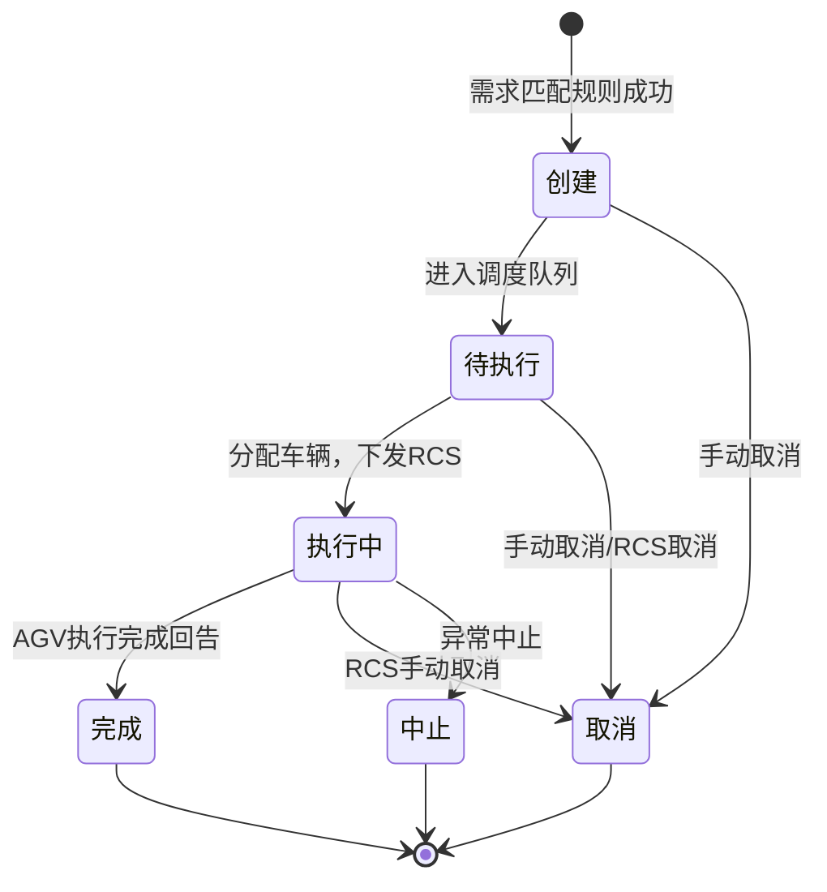

# 容器任务状态流转

## 状态枚举
| 状态 | 说明 |
|------|------|
| 创建 | 任务刚生成，未调度车辆 |
| 待执行 | 已进入调度队列，等待分配车辆 |
| 执行中 | 已分配车辆，AGV执行中 |
| 完成 | 任务正常执行完毕 |
| 取消 | 任务被手动取消或异常取消 |
| 中止 | 任务异常中止 |

## 状态流转图

## 状态动作说明
### 创建 → 待执行
- 触发：任务调度器拾取
- 动作：校验资源，进入车辆分配队列

### 待执行 → 执行中
- 触发：分配到空闲车辆
- 动作：
  1. 创建车辆任务
  2. 调用RCS接口下发任务
  3. 起点储位预占/锁定
  4. 深度组对应上架/下架标识置为已分配

### 执行中 → 完成
- 触发：RCS回告任务完成
- 动作：
  1. 更新任务状态为完成
  2. 终点储位状态更新（占用）
  3. 容器与终点储位绑定
  4. 起点储位释放（空闲）
  5. 解除起点容器绑定
  6. 深度组标识释放
  7. 执行状态对应动作配置（规则引擎）

### 执行中 → 取消
- 触发：RCS手动取消任务
- 动作：
  1. 任务状态置为取消
  2. 终点预占储位释放（若有）
  3. 起点容器状态置为可用
  4. 关联需求回退为【待处理】
  5. 深度组标识释放

### 执行中 → 中止
- 触发：不可恢复异常
- 动作：记录异常信息，人工介入处理

## 非法跳转（禁止操作）
| 当前状态 | 禁止操作 | 原因 |
|----------|----------|------|
| 完成 | 取消 | 已完成任务不可取消 |
| 完成 | 重新执行 | 需新建任务 |
| 取消 | 直接执行 | 需需求重新匹配生成新任务 |
| 中止 | 自动恢复 | 必须人工干预 |
