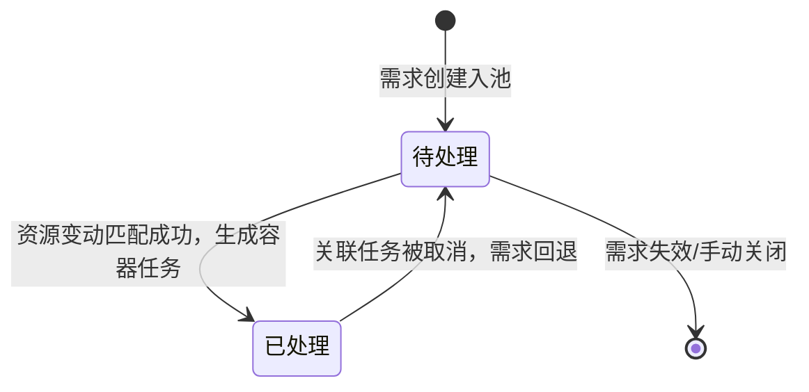

# 需求状态流转

## 状态枚举
| 状态 | 说明 |
|------|------|
| 待处理 | 需求已入池，等待资源匹配 |
| 已处理 | 已匹配规则生成容器任务 |

## 状态流转图

## 触发条件
### 进入【待处理】
1. WMS下发搬运需求
2. MES触发叫料/下料
3. UI（PAD/PDA）创建点对点/点对区搬运
4. 明眸/雷达检测触发自动需求
5. 深度组阻挡自动生成移库需求
6. 关联任务取消，需求回退

### 流转至【已处理】
资源变动事件触发，按优先级遍历需求池：
1. 需求匹配条件组
2. 条件组有关联规则
3. 起点满足取货规则、终点满足放货规则
全部通过 → 生成容器任务 → 需求置为已处理

### 回退至【待处理】
- 关联的容器任务被取消 → 需求重置为待处理，等待下次资源匹配

## 关键约束
- 同一储位若已有待处理需求 或 已有进行中任务，不重复生成同类型需求
- 移库需求：若阻挡储位已有待处理需求或进行中任务，不重复记录
- 资源变动包括：车辆资源、储位状态、容器、新增需求
