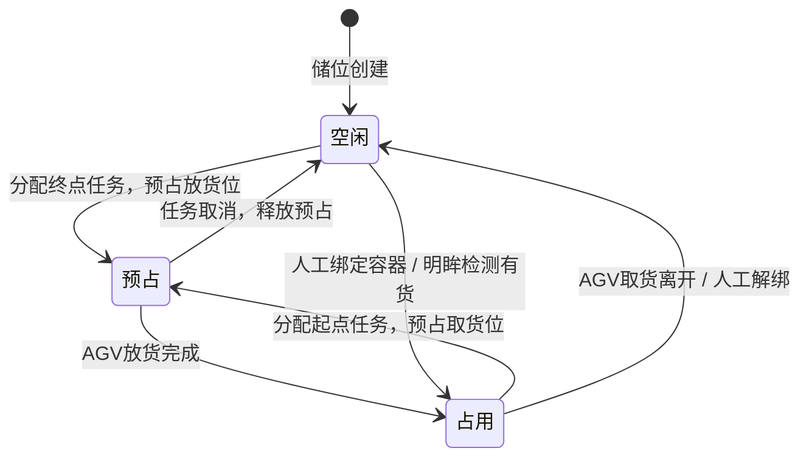
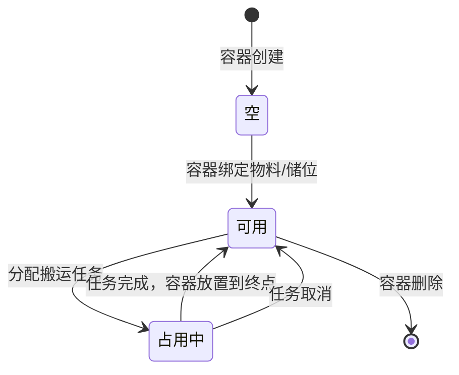

# 储位与容器状态流转

## 一、储位状态
### 状态枚举
| 状态 | 说明 |
|------|------|
| 空闲 | 储位无容器，可放货 |
| 占用 | 储位有容器绑定，有货 |
| 预占 | 已分配任务，即将放货/取货，其他任务不可用 |

### 状态流转图

### 状态变更触发
#### 空闲 → 占用
1. 人工储位绑定（带容器）
2. 明眸检测有货信号，自动创建容器并绑定
3. WMS下发有容器号的任务，容器绑定储位

#### 占用 → 空闲
1. AGV取货完成离开（任务状态：已离开起点）
2. 人工UI储位释放/解绑
3. 明眸检测无货且满足条件

#### 空闲 → 预占
- 任务分配，终点储位预占，防止多任务冲突

#### 预占 → 占用
- AGV到达终点放货完成，任务完成

#### 占用 → 预占
- 任务分配，起点储位锁定，防止重复分配

### 状态变更日志
所有储位状态变更均记录【储位状态变更日志】，包含变更前后状态、时间、操作人、关联任务ID。

---

## 二、容器状态
### 状态枚举
| 状态 | 说明 |
|------|------|
| 空 | 新建容器，无物料 |
| 可用 | 容器可被分配任务 |
| 占用中 | 容器正在执行任务 |

### 状态流转

### 容器与储位绑定规则
1. **绑定时机**
   - 上游有货信号触发，创建容器同时绑定起点储位
   - 任务完成，容器放置在终点储位并绑定
   - 人工UI操作绑定

2. **解绑时机**
   - 任务状态【已离开起点】，清除起点绑定
   - 人工UI操作解绑成功
   - 无货检测信号且满足条件

3. **特殊场景**
   - 容器不一定与储位绑定（需求池特殊处理场景）
   - 一个储位可临时放置多个容器（非绑定状态）
   - 绑定关系不会在同一储位重复出现

---

## 三、深度组状态标识
每个深度组维护三个独立标识：
| 标识 | 值=0 | 值=1 |
|------|-------|-------|
| 空闲标识 | 深度L最小深度储位空闲 | 非空闲 |
| 上架标识 | 已分配上架任务 | 未分配上架任务 |
| 下架标识 | 已分配下架任务 | 未分配下架任务 |

### 单进单出模式约束
同一深度组同一时间仅可分配：**1个上架任务 或 1个下架任务**（互斥）

### 一侧进一侧出模式约束
同一深度组同一时间可分配：**1个上架任务 + 1个下架任务**（并行）
