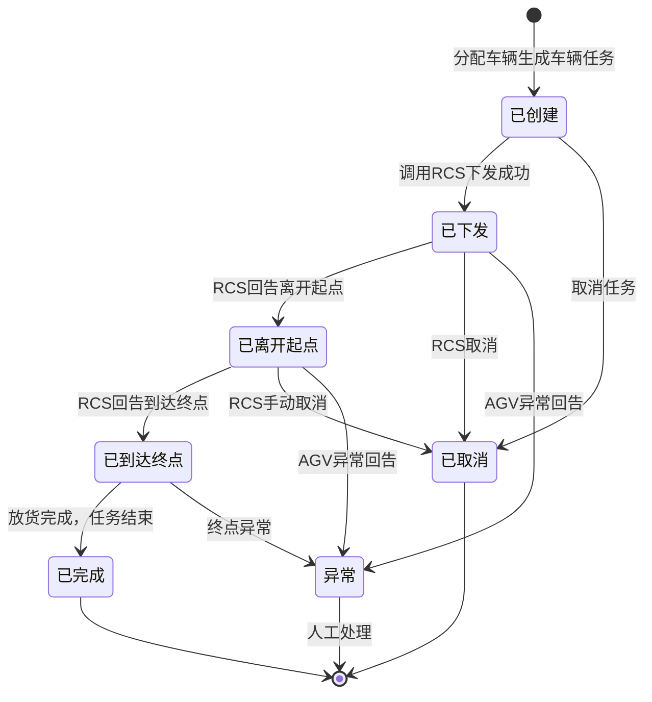
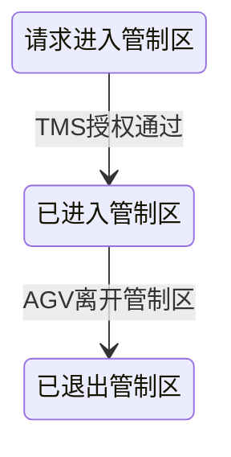

# 车辆任务状态流转

## 状态枚举
| 状态 | 说明 |
|------|------|
| 已创建 | 车辆任务刚生成，未下发RCS |
| 已下发 | 已调用RCS接口下发任务 |
| 已离开起点 | AGV已离开起点储位 |
| 已到达终点 | AGV已到达终点储位 |
| 已完成 | 任务执行完成 |
| 已取消 | 任务被取消 |
| 异常 | 执行过程出现异常 |

## 状态流转图

## 关键节点动作
### 已离开起点
- 清除起点储位与容器绑定关系
- 起点储位状态更新（释放为空闲）
- 起点为电梯储位 → 通知电梯控制系统释放电梯

### 已完成
- 容器与终点储位绑定
- 终点储位状态更新为占用
- 终点为电梯储位 → 通知电梯控制系统释放电梯
- 触发状态对应动作（规则引擎）
- 同步更新父容器任务、任务组状态

### 已取消
- 释放所有预占资源
- 关联需求回退为待处理
- 车辆资源释放回资源池

## 管制区状态子流程

- 每个管制区请求独立记录
- 门的开关状态与管制区AGV数量联动
