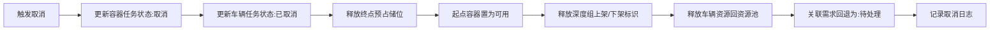

# 异常场景与中断流程

## 一、任务取消流程
### 触发场景
1. 人工后台手动取消任务
2. RCS端手动取消AGV任务
3. 任务异常无法继续执行

### 完整回滚流程

### 关键校验点
- 所有预占资源必须全部释放，无残留
- 需求正确回退，下次资源变动可重新匹配
- 深度组标识正确释放，不影响后续任务分配
- 已离开起点的任务取消，需处理容器当前位置状态

---

## 二、AGV异常回告
### 异常类型
#### 1. 起点无货异常
- 触发：AGV到达起点，发现储位无货
- 处理：
  1. 记录异常信息到任务
  2. 任务状态置为异常/中止
  3. 释放相关资源
  4. 人工介入核查

#### 2. 终点有货异常
- 触发：AGV到达终点，发现储位已有货
- 处理：
  1. 记录异常信息到任务
  2. 任务状态置为异常/中止
  3. 释放相关资源
  4. 人工介入处理终点储位

### 异常信号防护
当前储位存在进行中任务时：
- 收到任何外部有货/无货信号 → 不改变储位状态
- 信号标记为异常信号，关联记录到任务
- 避免外部干扰导致状态错乱

---

## 三、外部信号异常
### 重复触发防护
#### 有货信号重复
- 储位非空闲状态，再次收到有货信号 → 不处理
- 防止明眸重复检测导致重复创建容器

#### 无货信号重复
- 储位非占用状态，再次收到无货信号 → 不处理
- 防止状态异常翻转

### 信号与任务冲突
进行中任务所在储位收到外部信号：
- 不修改储位状态
- 记录异常信号日志
- 任务执行优先，避免干扰

---

## 四、资源不足异常
### 无可用车辆
- 容器任务保持【待执行】状态
- 等待车辆资源释放
- 资源变动时重新调度

### 无可用储位（点对区/移库）
- 终点逻辑区内无符合规则的空闲储位
- 需求保持【待处理】状态
- 不生成容器任务
- 储位资源变动后重新匹配

### 无可达路由
- 起点到终点无直达路由，也无组合路径
- 报错：无可选择路径
- 任务创建失败

---

## 五、深度组并发冲突
### 单进单出模式冲突
- 深度组已有上架任务分配中 → 新的上架任务等待
- 深度组已有下架任务分配中 → 新的下架任务等待
- 上下架任务互斥，不可同时分配

### 一侧进一侧出模式
- 上架、下架可各分配一个，并行执行
- 同方向第二个任务需等待

---

## 六、管制区与门异常
### 开门超时
- TMS持续请求开门，门未反馈开门到位
- 任务等待，不授权AGV进入
- 告警人工处理

### 多AGV管制区冲突
- 按请求顺序依次授权进入
- 门保持开启状态，直到所有AGV退出

---

## 七、任务中止后处理
所有异常中止任务：
1. 不可自动恢复执行
2. 必须人工介入核查原因
3. 确认无误后可重新创建需求/任务
4. 异常记录留存，不可删除
