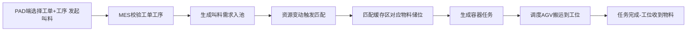
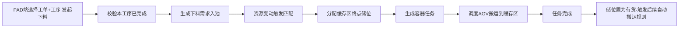
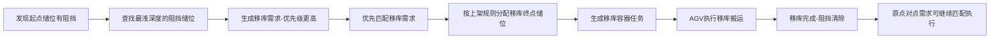

# 叫料/下料与移库主流程

## 一、叫料（上料）流程
### 业务场景
生产工位物料用完，通过PAD发起叫料请求，系统将物料从缓存区搬运到生产工位。

### 流程步骤

### 关键属性
- 模式：叫料（上料）
- 来源：MES触发 / UI触发
- 起点：缓存区物料储位（系统自动匹配）
- 终点：生产工位储位

---

## 二、下料流程
### 业务场景
生产工序完成后，通过PAD发起下料，将完工物料从生产工位搬运到缓存区。

### 流程步骤

### 后置触发
下料完成后，工位储位置为有货：
1. 系统自动检查是否满足自动搬运规则
2. 若满足（如烫金工序完成→需搬运到下一工序缓存区），自动生成新的搬运需求
3. 若不满足，则物料停留在当前储位等待叫料

---

## 三、移库流程
### 业务场景
深度组内，目标储位前面有其他容器阻挡，无法直接取货，系统自动将阻挡的容器移到其他位置，清出通路。

### 触发条件
点对点/点对区搬运任务，取货时发现起点储位前方有阻挡：
- 阻挡储位有货
- 阻挡储位无待处理需求
- 阻挡储位无进行中任务

### 流程步骤

### 核心规则
1. 多个阻挡时，仅先创建**深度最小**的阻挡储位移库需求
2. 移库需求优先级高于普通搬运需求
3. 阻挡储位已有待处理需求或进行中任务 → 不重复生成移库需求
4. 移库终点储位分配遵循深度组上架规则
5. 移库任务状态流转、动作与点对点搬运一致

### 移库参数控制
- 系统参数：移库开关（1=支持移库+混放，0=不支持）
- 当前所有移库逻辑基于参数=1的前提

---

## 四、自动触发搬运流程
### 触发场景
储位状态变更为有货时，系统自动检查是否满足预设规则，满足则自动生成搬运需求，无需人工操作。

### 典型场景
下料完成后，物料需自动流转到下一工序缓存区：
- 条件：缓存区新增储位绑定 + 流程卡标识匹配（本道工序=烫金，上一工序=胶印）+ 储位范围匹配
- 结果：自动生成搬运需求，物料从当前缓存区搬运到下一工序对应区域

### 判断逻辑
1. 储位置为有货事件触发
2. 遍历所有启用的规则
3. 条件组全部匹配 → 记录需求池
4. 资源变动时执行匹配生成任务
