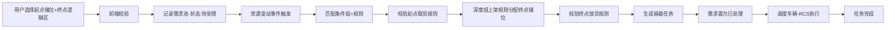

# 点对区搬运主流程

## 业务场景
用户指定起点储位和终点逻辑区，系统自动根据深度组上架规则在逻辑区内分配具体终点储位，触发AGV搬运。

## 完整流程步骤

## 核心逻辑说明

### 1. 需求创建
- 输入：起点储位、终点逻辑区、货型
- 终点不指定具体储位，仅指定逻辑区范围
- 需求入池，状态：待处理

### 2. 终点储位自动分配
资源变动触发需求匹配时：
1. 筛选终点逻辑区内所有符合条件的储位
2. 对应到所属深度组
3. 按深度组上架规则排序：
   - 相同批次库存由大→小，优先库存多的深度组
   - 库存相同按上架顺序由小→大
   - 无相同批次且混放开启，按上架顺序排序
4. 命中深度组后，按深度由大→小分配具体储位
5. 分配成功后，按点对点逻辑创建容器任务

### 3. 分配失败处理
- 逻辑区内无可用储位 → 不创建任务，需求保持待处理
- 混放关闭且无同批次深度组 → 提示无可用库位，需求等待
- 下次资源变动时重新尝试匹配

## 与点对点搬运异同
| 对比项 | 点对点 | 点对区 |
|--------|--------|--------|
| 终点 | 指定具体储位 | 指定逻辑区，系统自动分配 |
| 终点储位校验 | 创建需求时校验 | 生成任务时动态分配校验 |
| 任务执行逻辑 | 一致 | 一致 |
| 状态流转 | 一致 | 一致 |
| 状态对应动作 | 一致 | 一致 |

## 关键测试点
1. 终点逻辑区为空时的处理
2. 逻辑区内所有储位都占用时的处理
3. 深度组规则下储位分配顺序正确性
4. 混放参数开启/关闭的不同表现
5. 多需求并发时，储位分配不重复
6. 分配失败后，资源变动时是否重新匹配
