# 点对点搬运主流程

## 业务场景
用户通过PAD/PDA/后台手动指定起点储位和终点储位，触发AGV物料搬运。

## 完整流程步骤

```mermaid
flowchart LR
    A[用户选择起点+终点储位] --> B[前端校验]
    B --> C[记录需求池-状态:待处理]
    C --> D[资源变动事件触发]
    D --> E[按优先级遍历需求池]
    E --> F[匹配条件组+规则]
    F --> G[校验:起点取货规则]
    G --> H[校验:终点放货规则]
    H --> I[校验:深度组并发约束]
    I --> J[生成容器任务-状态:创建]
    J --> K[需求置为:已处理]
    K --> L[调度分配车辆]
    L --> M[生成车辆任务]
    M --> N[下发RCS执行]
    N --> O[AGV取货-离开起点]
    O --> P[AGV搬运中]
    P --> Q[AGV放货-到达终点]
    Q --> R[任务完成-状态更新]
    R --> S[执行状态对应动作]
```

## 各节点详细说明

### 1. 前端选择与校验
- 起点储位：必须为占用状态（有货），无待处理需求，无进行中任务
- 终点储位：必须为空闲状态，符合深度组上架顺序
- 支持多选起点储位，生成多条独立需求
- 终点储位仅可选一个

### 2. 入需求池
- 模式：点对点搬运
- 来源：UI
- 状态：待处理
- 记录起点、终点、优先级

### 3. 资源变动触发匹配
触发时机：车辆资源、储位状态、容器、新增需求 任一发生变动
匹配逻辑：
1. 按优先级从高到低遍历所有【待处理】需求
2. 匹配条件组 → 匹配关联规则
3. 起点取货规则校验 + 终点放货规则校验
4. 全部通过 → 生成容器任务

### 4. 任务生成与调度
- 生成容器任务（状态：创建）
- 需求状态更新为：已处理
- 容器任务进入调度队列 → 待执行
- 分配空闲车辆 → 生成车辆任务
- 调用RCS接口下发任务

### 5. 执行阶段
1. AGV前往起点
2. 到达起点取货 → 状态：已离开起点
   - 解除起点储位与容器绑定
   - 起点储位置为空闲
3. AGV搬运行驶（经过管制区需授权、开门）
4. 到达终点放货 → 状态：已到达终点
5. 任务完成 → 状态：已完成
   - 容器与终点储位绑定
   - 终点储位置为占用
   - 释放深度组标识
   - 释放车辆资源

### 6. 后置动作
- 执行状态对应动作配置
- 触发操作型规则（如满足条件）
- 记录操作日志、状态变更日志

## 关键校验点
| 阶段 | 校验项 |
|------|--------|
| 创建需求 | 起点有货、终点空闲、无重复需求 |
| 生成任务 | 条件组匹配、规则匹配、取放货规则、深度组并发 |
| 调度车辆 | 车辆空闲、路由可达 |
| 任务完成 | 储位状态正确、容器绑定正确、资源全部释放 |
